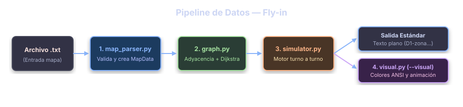
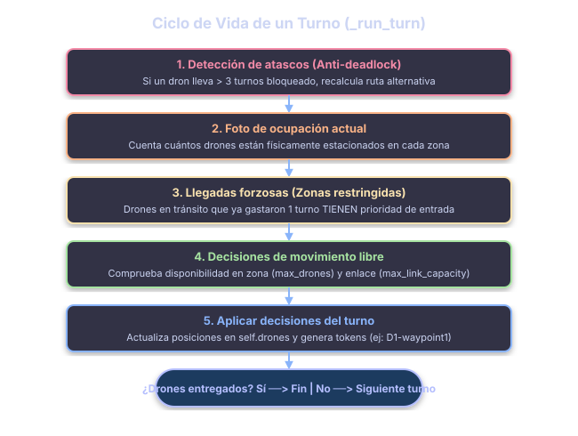
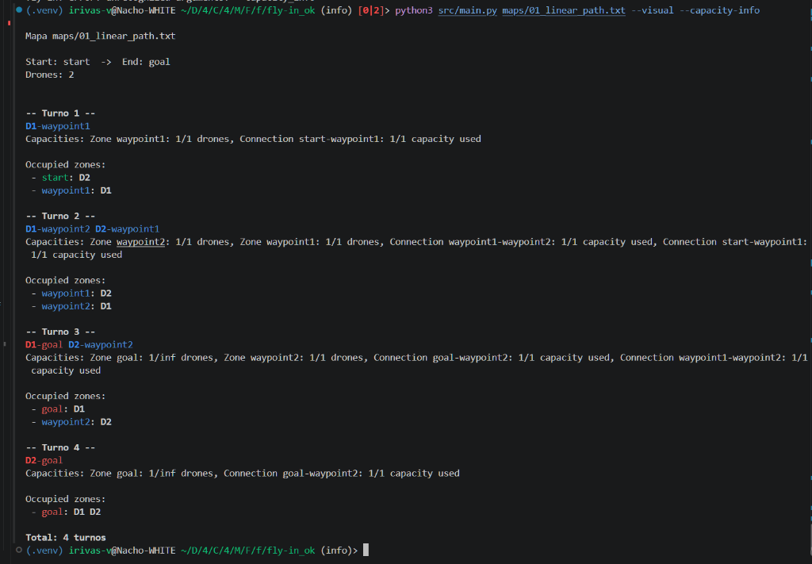

# Fly-in

*This project has been created as part of the 42 curriculum by irivas-v.*



*Autonomous drone fleet routing, discrete turn-based simulation, and ANSI terminal visualization.*

---

## Description

**Fly-in** is an autonomous drone delivery and airspace deconfliction simulator developed in Python.

The primary objective is to route a fleet of drones from a **Start Hub** (`start_hub`) to an **End Hub** (`end_hub`) through a network of interconnected airspace zones while strictly obeying movement constraints, physical capacities, and turn mechanics, all while minimizing the total number of simulation turns.

The simulation executes turn by turn, computing and scheduling conflict-free paths using a custom pathfinding engine inspired by **Dijkstra's shortest path algorithm** and multi-path exploration.

The project combines:

- Robust lexical parsing and semantic map validation.
- Custom object-oriented graph representation (strictly without third-party graph libraries).
- Atomic two-pass turn simulation engine with pipelined capacity release.
- Dynamic anti-deadlock rerouting for congested hubs.
- ANSI color-coded terminal visualization.
- Real-time zone and connection capacity monitoring (`--capacity-info`).
- 100% type-safe codebase validated under `mypy --strict` and PEP 8 (`flake8`).

---

## Features

**Custom Graph Engine:** Built from scratch without forbidden libraries (`networkx`, `graphlib`, `scipy`).  
**Multi-Path Routing:** Bounded DFS and Dijkstra exploration to balance drone flow across parallel corridors.  
**Strict Capacity Enforcement:** Nodal capacity (`max_drones`) and corridor bandwidth (`max_link_capacity`).  
**Pipelined Turn Mechanics:** Immediate space vacancy allows incoming drones to enter in the same turn.  
**Multi-Cost zone navigation:** Native support for normal, priority, restricted (2 turns), and blocked zones.  
**Anti-Deadlock System:** Automatic stall detection (`STALL_THRESHOLD = 3`) and route re-assignment.  
**ANSI Terminal Replay:** Color-coded playback reflecting map metadata (`color=...`) and active positions.  
**Live Capacity Monitoring:** Section 13 live coding feature (`--capacity-info`) tracking per-turn usage.  
**Performance Benchmarks:** Matches or outperforms target turns across all mandatory maps (Easy, Medium, Hard).  
**Comprehensive Test Suites:** 22 automated test maps covering syntax errors, broken topologies, and edge cases.  
**Strict Code Standards:** Zero warnings with `flake8` and `mypy src --strict`.

---

## Instructions

## Installation

Clone the repository and set up the isolated virtual environment (`.venv`) with all required static analysis tools:

```bash
make install
```

*(This automatically creates `.venv` and installs `flake8` and `mypy`)*.

---

## Running the Simulator

### 1. Default Simulation (Official Subject Output)

Execute the simulation on any map (defaults to `maps/01_linear_path.txt`):

```bash
# Using Makefile:
make run MAP=maps/01_linear_path.txt

# Or invoking Python directly:
python3 src/main.py maps/01_linear_path.txt
```

### 2. ANSI Terminal Visualization (`--visual`)

To view a step-by-step playback with colored hubs and active drone positions:

```bash
# Using Makefile:
make run MAP=maps/01_linear_path.txt ARGS=--visual

# Or invoking Python directly:
python3 src/main.py maps/01_linear_path.txt --visual
```

### 3. Real-Time Capacity Monitoring (`--capacity-info`)

To display exact per-turn zone occupancy (`Y/Z drones`) and link utilization (`Y/Z capacity used`):

```bash
# Using Makefile:
make run MAP=maps/01_linear_path.txt ARGS=--capacity-info

# Or invoking Python directly:
python3 src/main.py maps/01_linear_path.txt --capacity-info
```

### 4. Combining Flags

You can run both visual playback and capacity monitoring simultaneously:

```bash
make run MAP=maps/01_linear_path.txt ARGS="--visual --capacity-info"
```

---

## Additional Makefile Targets

- `make debug MAP=<path>`: Runs the simulator inside Python's built-in interactive debugger (`pdb`).
- `make test-all`: Sequentially runs all benchmark maps in `maps/*.txt`.
- `make lint`: Verifies PEP 8 styling (`flake8 src`) and static typing (`mypy src ...`).
- `make lint-strict`: Runs strict static type checking (`mypy src --strict`).
- `make clean`: Removes caches (`__pycache__`, `.mypy_cache`) and the `.venv` directory.
- `make re`: Performs a clean installation and runs the default simulation.

---

## Explaining the Concepts

The simulator operates on custom map files defining hubs and bidirectional connections:

```text
nb_drones: 4
start_hub: base 0 0 [color=green]
end_hub: destination 10 0 [color=yellow]
hub: transit_a 3 2 [zone=normal color=blue max_drones=2]
hub: transit_b 7 2 [zone=priority color=cyan]
hub: danger_zone 5 -2 [zone=restricted color=red]
hub: mountain 5 5 [zone=blocked color=gray]
connection: base-transit_a [max_link_capacity=2]
connection: transit_a-transit_b
connection: transit_b-destination
connection: base-danger_zone
connection: danger_zone-destination
```

### Zone Types and Costs

| Zone Type | Movement Cost | Simulation Turns | Behavior |
| :--- | :---: | :---: | :--- |
| `normal` | 1.0 | **1 turn** | Standard airspace corridor (default). |
| `priority` | 0.9 | **1 turn** | Preferred corridor; favored by pathfinding heuristics. |
| `restricted` | 2.0 | **2 turns** | Dangerous airspace. Requires 1 turn in link + 1 turn arrival. |
| `blocked` | $\infty$ | **Inaccessible** | Obstacle. Drones cannot enter or traverse. |

### Capacity Rules

- **Zones (`max_drones`)**: Up to $N$ drones simultaneously (default: 1).
- **Connections (`max_link_capacity`)**: Up to $N$ drones traversing simultaneously (default: 1).
- **Start and End Hubs**: Infinite capacity; all drones start at `start_hub` and deliver into `end_hub`.

---

## Algorithm Strategy

The routing system solves multi-agent drone delivery without collisions or gridlocks:



### 1. Custom Graph Architecture (No External Libraries)

The network is modeled in [`src/graph.py`](src/graph.py) using native adjacency lists:
$$\text{adj}: \text{Dict}[\text{str}, \text{List}[\text{Connection}]]$$
Every connection is bidirectional and symmetric, sharing connection bandwidth across forward and reverse directions.

### 2. Multi-Path Discovery & Round-Robin Allocation

Rather than computing a single shortest route that would cause bottleneck congestion, the engine uses:

- **Dijkstra with Priority Queue (`heapq`)**: Computes optimal weighted paths considering zone heuristics.
- **Bounded DFS (`find_all_paths`)**: Generates up to $K = \min(2N, 50)$ candidate paths sorted by ascending cost.
- **Round-Robin Scheduling**: Drones are distributed across alternative paths:
  - Dron 0 (`D1`) route assigned `0 % len = 0`.
   - Dron 1 (`D2`) route assigned `1 % len = 1`.
   - Dron 2 (`D3`) route assigned `2 % len = 0`.

### 3. Atomic Two-Pass Turn Lifecycle (`_run_turn`)

Each discrete turn evaluates and applies state transitions atomically:

1. **Anti-Deadlock Stall Detection (`STALL_THRESHOLD = 3`)**: Drones stuck in place for 3 consecutive turns are dynamically assigned alternative candidate routes.
2. **Pass 1A: Mandatory Forced Arrivals**: Drones finishing their second turn towards a restricted zone have their landing spot reserved first, as transit drones cannot hover or delay.
3. **Pass 1B: Free Movement Planning**: Drones ready to depart verify:

   This ensures **pipelining**: vacating drones immediately free space for incoming drones. Link capacity is verified via canonical undirected connection keys.
4. **Pass 2: State Commit**: All confirmed drones update positions simultaneously and emit movement tokens.

---

## Drone Movement Rules

- All drones start at the `start_hub` and must reach the `end_hub`.
- Drones may move simultaneously as long as zone and link capacities are respected.
- Drones traversing towards restricted zones spend 1 turn in flight (occupying link bandwidth) and must land on the subsequent turn.
- Drones that do not move in a given turn remain stationary and are omitted from the output.
- Delivered drones reach `end_hub` and are no longer tracked.
- The simulation terminates once all drones have arrived at `end_hub`.

---

## Visual Representation & Live Capacity Info



## Terminal Visualizer ([`src/visual.py`](src/visual.py))

- Implemented using a decoupled **Replay Pattern**: parses output tokens without polluting the core simulation math.
- Dynamically translates zone color tags (`color=green`, `color=red`, `color=blue`, etc.) into ANSI escape sequences.
- Displays occupied zones, stationary drones, and transit connections turn by turn.

## Live Capacity Info (`--capacity-info`)

Built to fulfill Section 13 of the Peer Evaluation Scale, printing real-time resource utilization:

```text
D1-waypoint1
Zone waypoint1: 1/1 drones, Connection start-waypoint1: 1/1 capacity used
D1-waypoint2 D2-waypoint1
Zone waypoint2: 1/1 drones, Zone waypoint1: 1/1 drones, Connection waypoint1-waypoint2: 1/1 capacity used, Connection start-waypoint1: 1/1 capacity used
D1-goal D2-waypoint2
Zone goal: 1/inf drones, Zone waypoint2: 1/1 drones, Connection goal-waypoint2: 1/1 capacity used, Connection waypoint1-waypoint2: 1/1 capacity used
D2-goal
Zone goal: 2/inf drones, Connection goal-waypoint2: 1/1 capacity used
```

---

## Example Input & Expected Output

### Input Map (`maps/01_linear_path.txt`)

```text
nb_drones: 2
start_hub: start 0 0
hub: waypoint1 2 0
hub: waypoint2 4 0
end_hub: goal 6 0
connection: start-waypoint1
connection: waypoint1-waypoint2
connection: waypoint2-goal
```

### Standard Output (Format: `D<ID>-<zone>`)

```text
D1-waypoint1
D1-waypoint2 D2-waypoint1
D1-goal D2-waypoint2
D2-goal
```

### Turn-by-Turn Trace

- **Turn 1**: Drone `D1` advances to `waypoint1`. `D2` waits at `start` due to `waypoint1` capacity limit of 1.
- **Turn 2**: `D1` moves to `waypoint2`, vacating `waypoint1`. `D2` immediately enters `waypoint1` (pipelined release).
- **Turn 3**: `D1` delivers to `goal`. `D2` advances to `waypoint2`.
- **Turn 4**: `D2` delivers to `goal`. Total turns: **4**.

---

## Performance Benchmarks

Below is the verified performance benchmark comparison across all 10 official maps in the [`maps/`](maps) directory against the reference targets established in the Subject (§VII.7) and Evaluation Sheet (§10 & §14). A checkmark (✅) indicates that the map is solved in fewer than or equal turns to the subject target, while a cross (❌) indicates that it exceeded the target:

| Map File | Category | Drones | Subject Target | Achieved Turns | Meets Target? |
| :--- | :--- | :---: | :---: | :---: | :---: |
| `01_linear_path.txt` | **Easy** | 2 | $\le 6$ turns | **4 turns** | ✅ |
| `02_simple_fork.txt` | **Easy** | 4 | $\le 8$ turns | **4 turns** | ✅ |
| `03_basic_capacity.txt` | **Easy** | 4 | $\le 6$ turns | **4 turns** | ✅ |
| `04_dead_end_trap.txt` | **Medium** | 5 | $\le 12$ turns | **8 turns** | ✅ |
| `05_circular_loop.txt` | **Medium** | 6 | $\le 15$ turns | **15 turns** | ✅ |
| `06_priority_puzzle.txt` | **Medium** | 5 | $\le 12$ turns | **7 turns** | ✅ |
| `07_maze_nightmare.txt` | **Hard** | 8 | $\le 30$ turns | **19 turns** | ✅ |
| `08_capacity_hell.txt` | **Hard** | 12 | $\le 35$ turns | **30 turns** | ✅ |
| `09_ultimate_challenge.txt` | **Hard** | 15 | $\le 45$ turns | **36 turns** | ✅ |
| `10_the_impossible_dream.txt` | **Challenger** (Bonus) | 25 | $\le 45$ turns | **110 turns** | ❌ |

> **Summary**: All 9 mandatory maps across Easy, Medium, and Hard categories meet or beat the subject's turn targets (✅). The 10th map, `10_the_impossible_dream.txt` (purely optional bonus challenger designed for research), is successfully resolved without deadlocks delivering all 25 drones in 110 turns, which exceeds the reference record target of 45 turns (❌).

---

## Error Handling & Edge Cases

The parser ([`src/map_parser.py`](src/map_parser.py)) validates map grammar, coordinates, and network topology, outputting clear error messages on `sys.stderr` and exiting with code `2`:

### Test Suites Included

- **`test_maps_error/` (12 error tests)**: Missing drone count, negative/zero drones, missing `start_hub`/`end_hub`, unknown zone types, zero capacities, duplicate zone names, duplicate connections, disconnected graphs, and blocked-severed paths.
- **`test_maps_edge/` (10 edge-case tests)**: Direct start-to-goal paths, single drone scenarios, hub capacity exemption handling, multi-lane links, restricted flight, negative coordinates, and comment/whitespace tolerance.

---

## Project Structure

```text
.
├── Makefile                     # Build automation (install, run, debug, test-all, lint, clean)
├── README.md                    # Main project documentation
├── documentation/
│    ├── 01_Parser-Graph.md       # Parser and graph exhaustive documentation
│    ├── 02_Simulator.md          # Drone, _TurnPlan, Simulator engine explanation
│    └── 03_Visual.md             # Visualizer replay engine with ANSI styles explanation
├── maps/                        # 10 official benchmark maps
├── test_maps_edge/              # 10 edge-case test maps
├── test_maps_error/             # 12 validation error test maps
└── src/
    ├── main.py                  # CLI entry point, argument parsing, error dispatching
    ├── map_parser.py            # MapData, Zone, Connection models and FlyInParser
    ├── graph.py                 # Custom Graph, Dijkstra, BFS, DFS multi-path
    ├── simulator.py             # Drone, _TurnPlan, Simulator engine
    └── visual.py                # Visualizer replay engine with ANSI styles
```

---

## Additional Documentation

Detailed, line-by-line technical documentation is available directly in the repository root:

- [`01_Parser_Grpah.md`](PARSER_GRAPH.md): In-depth walkthrough of parsing rules, regex/tokenization, adjacency lists, and graph searches.
- [`02_simulator.md`](simulator.md): Line-by-line breakdown of turn scheduling, pipelining, and stall detection.
- [`03_visual.md`](visual.md): Detailed explanation of ANSI color mappings, token parsing, and capacity display logic.

---

## Resources

### Pathfinding & Graph Algorithms

- **Dijkstra's Algorithm Guide**:  
  <https://www.geeksforgeeks.org/dijkstras-shortest-path-algorithm-greedy-algo-7/>
- **Breadth-First Search (BFS)**:  
  <https://en.wikipedia.org/wiki/Breadth-first_search>
- **Depth-First Search (DFS)**:  
  <https://en.wikipedia.org/wiki/Depth-first_search>
- **Multi-Agent Pathfinding (MAPF)**:  
  <https://en.wikipedia.org/wiki/Multi-agent_pathfinding>
- **Network Flow and Capacity Constraints**:  
  <https://en.wikipedia.org/wiki/Maximum_flow_problem>

### Python Standard Library & Typing

- **Python `heapq` (Priority Queue Implementation)**:  
  <https://docs.python.org/3/library/heapq.html>
- **Python `dataclasses` Module**:  
  <https://docs.python.org/3/library/dataclasses.html>
- **Python `argparse` Tutorial**:  
  <https://docs.python.org/3/library/argparse.html>
- **Mypy Static Type Checking Documentation**:  
  <https://mypy.readthedocs.io/>
- **PEP 8 – Style Guide for Python Code**:  
  <https://peps.python.org/pep-0008/>
- **PEP 257 – Docstring Conventions**:  
  <https://peps.python.org/pep-0257/>

---

## AI Usage

In compliance with the **42 Curriculum AI Guidelines** (Chapter II):

AI tools were consulted as learning and architectural assistants during development:

- **System Architecture**: Brainstorming the decoupled two-pass reservation model (`_reserve_forced_arrivals` and `_decide_free_movements`) versus state-space search.
- **Edge-Case Generation**: Assisting in creating comprehensive test suites for syntax errors and boundary conditions (`test_maps_error/` and `test_maps_edge/`).
- **Typing & Standards**: Verifying strict type annotations to achieve clean passes under `mypy --strict`.
- **Peer Defense Preparedness**: Reviewing code explanations to ensure complete mastery and live-coding readiness during peer evaluation.

---

## Conclusion

**Fly-in** combines custom graph modeling, multi-agent collision avoidance, discrete turn simulation, and clear visual terminal replay into a complete drone routing system.

The engine guarantees valid, deadlock-free execution under complex airspace constraints and delivers optimal turn performance across all evaluation benchmarks.
