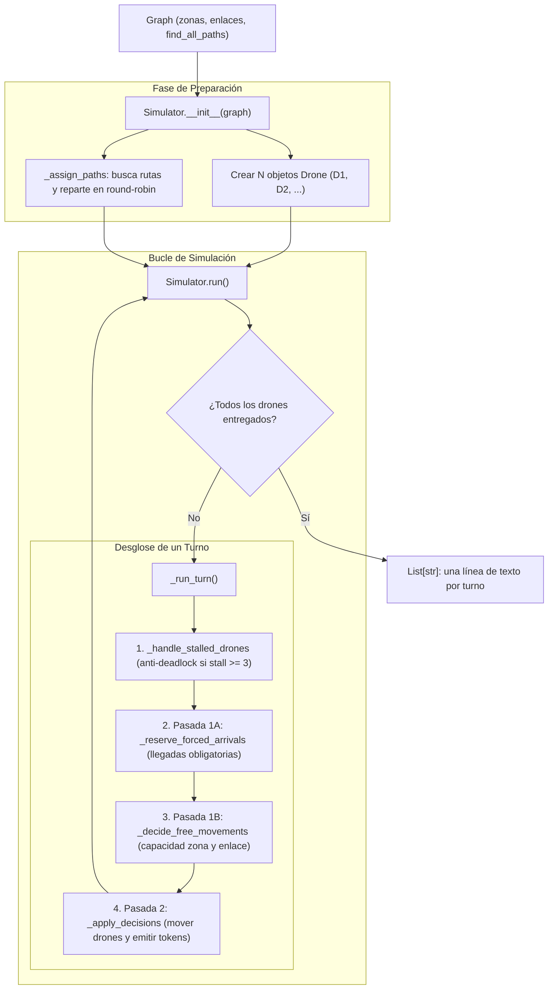
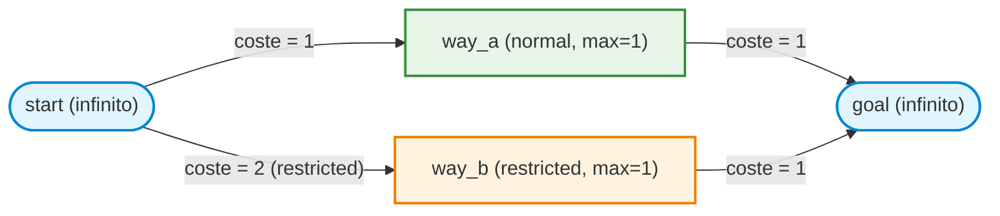
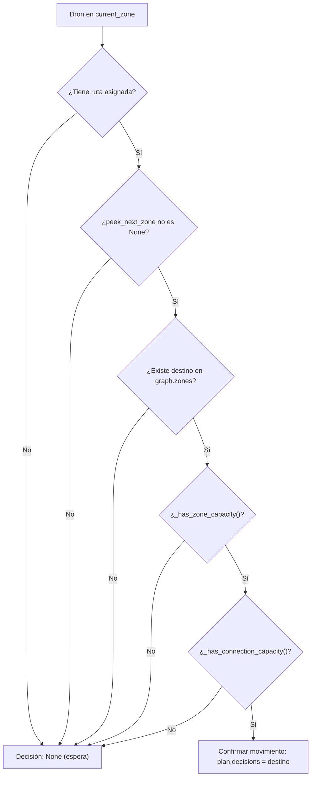
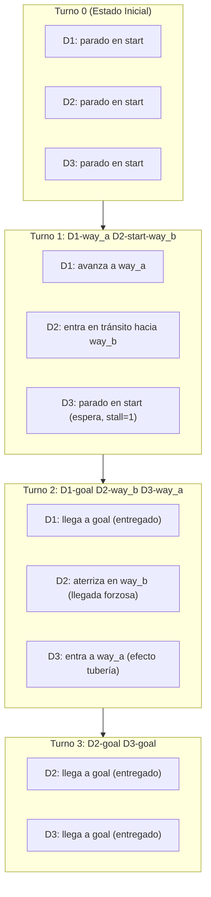

# Simulator — Explicación detallada

> Este documento explica **línea a línea y concepto a concepto** cómo funciona `simulator.py`
> del proyecto Fly-in. A lo largo del documento utilizaremos un **mapa de ejemplo visual**
> para ver cómo se mueven los drones turno a turno, cómo se rellenan las reservas y
> por qué se han tomado cada una de las decisiones de diseño del algoritmo.

---

## Índice

1. [[#1. El flujo general y la arquitectura del simulador|1. El flujo general y la arquitectura del simulador]]
2. [[#2. El mapa de ejemplo|2. El mapa de ejemplo]]
3. [[#3. Las estructuras de datos auxiliares|3. Las estructuras de datos auxiliares]]
   - [[#3.1 La constante STALL_THRESHOLD|3.1 La constante STALL_THRESHOLD]]
   - [[#3.2 Drone — el estado individual de cada dron|3.2 Drone — el estado individual de cada dron]]
   - [[#3.3 Por qué peek_next_zone no avanza el dron|3.3 Por qué peek_next_zone no avanza el dron]]
   - [[#3.4 Representación para depuración (__repr__) de Drone|3.4 Representación para depuración (__repr__) de Drone]]
   - [[#3.5 _TurnPlan — el plan atómico de un turno|3.5 _TurnPlan — el plan atómico de un turno]]
   - [[#3.6 La clave canónica de conexión (_canonical_connection_key)|3.6 La clave canónica de conexión (_canonical_connection_key)]]
4. [[#4. La clase Simulator — método a método|4. La clase Simulator — método a método]]
   - [[#4.1 __init__ — inicialización y creación de drones|4.1 __init__ — inicialización y creación de drones]]
   - [[#4.2 _assign_paths — reparto round-robin de rutas|4.2 _assign_paths — reparto round-robin de rutas]]
   - [[#4.3 run — el bucle principal y el límite de seguridad|4.3 run — el bucle principal y el límite de seguridad]]
   - [[#4.4 _todos_entregados — condición de parada|4.4 _todos_entregados — condición de parada]]
   - [[#4.5 _run_turn — la orquestación del turno en dos pasadas|4.5 _run_turn — la orquestación del turno en dos pasadas]]
   - [[#4.6 _handle_stalled_drones y _reassign_stalled — anti-deadlock|4.6 _handle_stalled_drones y _reassign_stalled — anti-deadlock]]
   - [[#4.7 _compute_current_occupancy — ocupación estática|4.7 _compute_current_occupancy — ocupación estática]]
   - [[#4.8 Pasada 1A: _reserve_forced_arrivals — llegadas obligatorias|4.8 Pasada 1A: _reserve_forced_arrivals — llegadas obligatorias]]
   - [[#4.9 Pasada 1B: _decide_free_movements — decisiones libres|4.9 Pasada 1B: _decide_free_movements — decisiones libres]]
   - [[#4.10 _has_zone_capacity y ocupación efectiva (pipelining)|4.10 _has_zone_capacity y ocupación efectiva (pipelining)]]
   - [[#4.11 _count_drones_leaving_zone — detectar huecos que quedan libres|4.11 _count_drones_leaving_zone — detectar huecos que quedan libres]]
   - [[#4.12 _has_connection_capacity y _max_link_capacity|4.12 _has_connection_capacity y _max_link_capacity]]
   - [[#4.13 Pasada 2: _apply_decisions — ejecución simultánea|4.13 Pasada 2: _apply_decisions — ejecución simultánea]]
   - [[#4.14 _move_drone_towards, _continue_transit y _start_new_move|4.14 _move_drone_towards, _continue_transit y _start_new_move]]
   - [[#4.15 __repr__ — depuración y estado del simulador|4.15 __repr__ — depuración y estado del simulador]]
5. [[#5. Seguimiento paso a paso con el mapa de ejemplo|5. Seguimiento paso a paso con el mapa de ejemplo]]
   - [[#5.1 Estado inicial (Turno 0)|5.1 Estado inicial (Turno 0)]]
   - [[#5.2 Turno 1: salida de los primeros drones|5.2 Turno 1: salida de los primeros drones]]
   - [[#5.3 Turno 2: llegada forzosa y efecto tubería|5.3 Turno 2: llegada forzosa y efecto tubería]]
   - [[#5.4 Turno 3: entregas y avance|5.4 Turno 3: entregas y avance]]
   - [[#5.5 Turno 4: entrega final y cierre|5.5 Turno 4: entrega final y cierre]]
6. [[#6. Criterios y decisiones de diseño: ¿por qué se hizo así?|6. Criterios y decisiones de diseño: ¿por qué se hizo así?]]
7. [[#7. Resumen de tokens y formato de salida (§VII.5)|7. Resumen de tokens y formato de salida (§VII.5)]]
8. [[#8. Punto de entrada (__main__) y ejecución desde consola|8. Punto de entrada (__main__) y ejecución desde consola]]

 

## 1. El flujo general y la arquitectura del simulador

El simulador es el motor central del proyecto Fly-in. Una vez que `map_parser.py` ha leído el archivo y `graph.py` ha modelado las conexiones y calculado las rutas disponibles, `simulator.py` se encarga de mover los drones turno a turno hasta llevarlos a todos desde `start` hasta `end`.



### La regla de oro del subject: Las dos pasadas (§VII.3)

El subject de Fly-in establece un requisito ineludible:
> *"A turn is resolved in two phases: first, all movements are determined and validated; then, all valid movements occur simultaneously."*

En `simulator.py`, este principio se respeta mediante una clara separación:
1. **Fase de Decisión (Pasada 1)**: Se analizan todos los drones y se rellena un objeto `_TurnPlan`. En esta fase **ningún dron cambia físicamente de posición**. Solo se calcula a dónde quiere y puede ir cada uno, reservando virtualmente las plazas.
2. **Fase de Aplicación (Pasada 2)**: Con el plan cerrado y verificado, se actualizan las posiciones de todos los drones de forma atómica y simultánea, generando la línea de texto correspondiente al turno.

---

## 2. El mapa de ejemplo

Para poder seguir de forma visual y concreta cada explicación, usaremos un mapa representativo que incluye los aspectos más importantes del subject:
- Rutas paralelas con diferente longitud y coste.
- Una zona con restricción de capacidad (`max_drones=1`).
- Una zona de tipo `restricted` (que requiere 2 turnos para entrar).
- 3 drones compitiendo por llegar al objetivo.

```
nb_drones: 3

start_hub: start 0 0
hub: way_a 1 1 [max_drones=1]
hub: way_b 1 -1 [zone=restricted max_drones=1]
end_hub: goal 2 0

connection: start-way_a
connection: way_a-goal
connection: start-way_b
connection: way_b-goal
```



En este mapa existen dos caminos para ir de `start` a `goal`:
1. **Ruta A**: `["start", "way_a", "goal"]` — Pasa por una zona normal. Coste total: 1 + 1 = **2 turnos**.
2. **Ruta B**: `["start", "way_b", "goal"]` — Pasa por una zona `restricted`. Entrar a `way_b` toma 2 turnos y llegar a `goal` toma 1 turno. Coste total: 2 + 1 = **3 turnos**.

---

## 3. Las estructuras de datos auxiliares

Antes de ver los métodos de la simulación, analizamos las clases y estructuras que utiliza el archivo.

### 3.1 La constante STALL_THRESHOLD

```python
STALL_THRESHOLD: int = 3
```

- **Qué hace**: Define cuántos turnos seguidos puede estar un dron sin moverse antes de que el simulador lo considere "atascado" e intente asignarle otra ruta.
- **Por qué vale 3**: Si valiese 1, un dron cambiaría de ruta a la primera que encuentre a otro dron cruzando delante, produciendo cambios de ruta nerviosos e innecesarios. Si valiese 10, tardaría demasiado en reaccionar ante cuellos de botella reales. El valor 3 da un margen prudente: permite que un dron espere a que otro desaloje la casilla (1 o 2 turnos de espera habituales) y, si el atasco persiste, busca una alternativa.

---

### 3.2 Drone — el estado individual de cada dron

```python
@dataclass
class Drone:
    drone_id: int
    current_zone: str
    path: List[str] = field(default_factory=list)
    path_index: int = 0
    turns_remaining: int = 0
    next_zone: Optional[str] = None
    delivered: bool = False
    stall_count: int = 0
    route_index: int = 0
```

Cada dron mantiene su propio ciclo de vida:

| Atributo | Tipo | Función |
|---|---|---|
| `drone_id` | `int` | Número identificativo (1 para D1, 2 para D2, etc.). |
| `current_zone` | `str` | Zona donde se encuentra físicamente. |
| `path` | `List[str]` | Lista de zonas que forman su ruta completa (ej. `["start", "way_a", "goal"]`). |
| `path_index` | `int` | Índice de su posición actual dentro de `path`. Por ejemplo, si está en `start`, `path_index` es 0; si pasa a `way_a`, es 1. |
| `turns_remaining` | `int` | Contador de turnos restantes cuando el dron está a mitad de camino hacia una zona `restricted` (vale 1 en el primer turno de tránsito y 0 al llegar). |
| `next_zone` | `Optional[str]` | Zona de destino mientras dura el tránsito de 2 turnos. Si no está en tránsito, es `None`. |
| `delivered` | `bool` | Se activa en `True` cuando el dron alcanza el `end_hub` (`goal`). A partir de ese momento queda fuera de la simulación activa. |
| `stall_count` | `int` | Turnos consecutivos que lleva parado sin avanzar. |
| `route_index` | `int` | Índice de la ruta que tiene asignada dentro de la lista de rutas globales `_routes` del simulador. |

#### Propiedades calculadas:

```python
@property
def in_transit(self) -> bool:
    return self.turns_remaining > 0

@property
def label(self) -> str:
    return f"D{self.drone_id}"
```

- `in_transit`: Informa de si el dron está "en el aire", en mitad de una conexión restricted.
- `label`: Devuelve la etiqueta estándar exigida por el subject: `D1`, `D2`, etc.

---

### 3.3 Por qué peek_next_zone no avanza el dron

```python
def peek_next_zone(self) -> Optional[str]:
    siguiente_indice = self.path_index + 1
    if siguiente_indice >= len(self.path):
        return None
    return self.path[siguiente_indice]
```

- **Por qué se hace así**: "Peeking" significa echar un vistazo hacia adelante sin tocar el puntero.
- Durante la **Pasada 1**, el simulador necesita consultar: *"Dron D1, si te movieses ahora, ¿a qué zona irías?"*.
- Si se modificase directamente `path_index`, el dron habría cambiado de estado antes de verificar si la zona de destino o la conexión tienen plazas libres.
- `peek_next_zone()` lee `path[path_index + 1]` de forma puramente de solo lectura. Solo si todas las comprobaciones de capacidad son favorables en la Pasada 1, la Pasada 2 incrementará `path_index`.

---

### 3.4 Representación para depuración (__repr__) de Drone

```python
def __repr__(self) -> str:
    if self.delivered:
        estado = "delivered"
    elif self.in_transit:
        estado = f"in transit to {self.next_zone} ({self.turns_remaining} turn(s) left)"
    else:
        estado = f"waiting at {self.current_zone} (stall={self.stall_count})"
    return f"Drone(D{self.drone_id} | {estado} | path={self.path})"
```

- **Utilidad**: Facilita enormemente el rastreo durante la depuración o en tests interactivos. En lugar de imprimir una instancia genérica de dataclass, muestra de inmediato si el dron está entregado, en pleno vuelo hacia una zona restringida con los turnos que le restan, o esperando en una zona con su contador de bloqueo actual.

---

### 3.5 _TurnPlan — el plan atómico de un turno

```python
@dataclass
class _TurnPlan:
    decisions: Dict[int, Optional[str]] = field(default_factory=dict)
    reserved_zones: Dict[str, int] = field(default_factory=dict)
    reserved_conns: Dict[Tuple[str, str], int] = field(default_factory=dict)
    leaving_drones: "set[int]" = field(default_factory=set)
```

En lugar de pasar 4 diccionarios o listas dispersas entre funciones (`decisiones`, `plazas_zonas`, `plazas_enlaces`, `quienes_salen`), se encapsula todo en el objeto `_TurnPlan`.

- `decisions`: Diccionario `{drone_id: destino}`. Si un dron no puede moverse o está esperando, guarda `{drone_id: None}`.
- `reserved_zones`: Cuenta cuántas plazas se han reservado para entrar en cada zona durante este turno.
- `reserved_conns`: Cuenta cuántos drones cruzarán cada enlace durante este turno.
- `leaving_drones`: Conjunto (`set`) con los IDs de los drones que van a abandonar su zona actual. Es clave para calcular si se libera espacio para otro dron simultáneamente.

---

### 3.6 La clave canónica de conexión (_canonical_connection_key)

```python
@staticmethod
def _canonical_connection_key(zona_a: str, zona_b: str) -> Tuple[str, str]:
    if zona_a <= zona_b:
        return (zona_a, zona_b)
    return (zona_b, zona_a)
```

- **El problema**: Las conexiones en Fly-in son **bidireccionales**. Si la conexión entre `way_a` y `way_b` tiene capacidad máxima de 1 dron por turno (`max_link_capacity=1`), no puede permitirse que un dron vaya de `way_a` a `way_b` y simultáneamente otro vaya de `way_b` a `way_a` en sentido contrario.
- **La solución**: Si usamos como clave de diccionario la tupla ordenada alfabéticamente `("way_a", "way_b")`, tanto el movimiento `way_a -> way_b` como `way_b -> way_a` compartirán exactamente la misma clave en `reserved_conns`. De esta forma, el recuento de capacidad es único y compartido.

---

## 4. La clase Simulator — método a método

### 4.1 __init__ — inicialización y creación de drones

```python
def __init__(self, graph: Graph) -> None:
    self.graph: Graph = graph
    self.turn: int = 0
    self._routes: List[List[str]] = []

    self.drones: List[Drone] = []
    for indice in range(graph.nb_drones):
        nuevo_dron = Drone(drone_id=indice + 1, current_zone=graph.start)
        self.drones.append(nuevo_dron)

    self._assign_paths()
```

- **Por qué `indice + 1`**: En Python los índices empiezan en 0, pero el formato oficial de Fly-in numera los drones desde 1 (`D1, D2, D3, ...`).
- **Estado inicial**: Todos los drones se sitúan físicamente en `graph.start`.
- **Rutas globales**: Se prepara la lista `self._routes` que almacenará los caminos calculados una sola vez.

---

### 4.2 _assign_paths — reparto round-robin de rutas

```python
def _assign_paths(self) -> None:
    rutas_encontradas = self.graph.find_all_paths(
        self.graph.start,
        self.graph.end,
        max_paths=self.graph.nb_drones * 2,
    )

    if not rutas_encontradas:
        raise ValueError(
            f"No existe ninguna ruta válida entre '{self.graph.start}' y '{self.graph.end}'."
        )

    self._routes = []
    for _coste, ruta in rutas_encontradas:
        self._routes.append(ruta)

    for indice, dron in enumerate(self.drones):
        dron.route_index = indice % len(self._routes)
        dron.path = self._routes[dron.route_index]
```

#### Criterios y decisiones tomadas:
1. **Búsqueda anticipada de múltiples rutas**: Se piden hasta `nb_drones * 2` rutas a `graph.find_all_paths()`. Esto garantiza tener suficientes alternativas para repartir a los drones.
2. **Validación inmediata**: Si no hay rutas posibles (por ejemplo, porque el mapa está desconectado o todas las salidas están bloqueadas con `zone=blocked`), se lanza `ValueError` antes de gastar recursos simulando.
3. **Distribución en Round-Robin**:
   - Dron 0 (`D1`) recibe la ruta `0 % len = 0`.
   - Dron 1 (`D2`) recibe la ruta `1 % len = 1`.
   - Dron 2 (`D3`) recibe la ruta `2 % len = 0`.
   - **Por qué round-robin**: Si todos los drones intentasen ir por la ruta más corta (Ruta 0), se estorbarían mutuamente en casillas de capacidad 1. Repartirlos entre los caminos alternativos desde el inicio aprovecha la red de forma paralela.

---

### 4.3 run — el bucle principal y el límite de seguridad

```python
def run(self) -> List[str]:
    lineas_de_salida: List[str] = []

    while not self._todos_entregados():
        self.turn += 1
        linea_del_turno = self._run_turn()
        lineas_de_salida.append(linea_del_turno)

        if self.turn > 1000:
            raise ValueError("Simulación finalizada. Más de 1000 turnos sin entregar todos los drones. Posible deadlock.")

    return lineas_de_salida
```

- **Qué hace**: Ejecuta turnos de forma secuencial mientras queden drones activos. Cada turno devuelve una cadena formateada con los movimientos efectuados (ej: `"D1-way_a D2-start-way_b"`).
- **Por qué el límite `turn > 1000`**: En problemas de tráfico discreto existe el riesgo de **deadlock** (bloqueo mutuo donde dos drones se bloquean el paso en sentidos opuestos) o **livelock** (drones alternando rutas indefinidamente). Sin una cota máxima, el programa entraría en un bucle infinito que congelaría el sistema. Un tope de 1000 turnos protege la ejecución y alerta de un mapa patológico o irresoluble.

---

### 4.4 _todos_entregados — condición de parada

```python
def _todos_entregados(self) -> bool:
    for dron in self.drones:
        if not dron.delivered:
            return False
    return True
```

- **Por qué bucle simple**: Aunque podría escribirse `all(d.delivered for d in self.drones)`, un bucle explícito con salida temprana (`return False` en el primer dron no entregado) es inmediato de inspeccionar y depurar con herramientas de trazado.

---

### 4.5 _run_turn — la orquestación del turno en dos pasadas

```python
def _run_turn(self) -> str:
    self._handle_stalled_drones()

    ocupacion_actual = self._compute_current_occupancy()
    plan = _TurnPlan()

    self._reserve_forced_arrivals(plan)
    self._decide_free_movements(plan, ocupacion_actual)

    return self._apply_decisions(plan)
```

Este método es el corazón del turno y coordina los 4 pasos exactos:
1. **Gestión de atascos**: Si algún dron lleva demasiado tiempo parado, rota su ruta antes de calcular nada.
2. **Foto fija del estado actual**: Calcula cuántos drones hay sentados en cada zona (`_compute_current_occupancy`).
3. **Pasada 1A (Llegadas forzosas)**: Quien ya estaba cruzando hacia una zona `restricted` reserva su plaza de forma prioritaria.
4. **Pasada 1B (Decisiones libres)**: El resto de drones comprueba si tiene hueco libre en la zona y en la conexión.
5. **Pasada 2 (Aplicación)**: Se aplican todos los movimientos a la vez y se genera el string del turno.

---

### 4.6 _handle_stalled_drones y _reassign_stalled — anti-deadlock

```python
def _handle_stalled_drones(self) -> None:
    for dron in self.drones:
        if dron.delivered:
            continue
        if dron.in_transit:
            continue
        if dron.stall_count >= STALL_THRESHOLD:
            self._reassign_stalled(dron)
```

Si un dron no está entregado, no está volando hacia una restricted y lleva $\ge 3$ turnos esperando:

```python
def _reassign_stalled(self, dron: Drone) -> None:
    if not self._routes:
        return

    dron.route_index = (dron.route_index + 1) % len(self._routes)
    nueva_ruta = self._routes[dron.route_index]
    dron.path = nueva_ruta
    dron.stall_count = 0

    if dron.current_zone in nueva_ruta:
        dron.path_index = nueva_ruta.index(dron.current_zone)
    else:
        dron.path_index = 0
```

#### Decisiones de diseño en la reasignación:
1. **Guarda defensiva (`if not self._routes: return`)**: Aunque `_assign_paths()` garantiza que existe al menos una ruta al inicializar el simulador, esta cláusula protege el método ante invocaciones anómalas o tests aislados.
2. **Rotación circular**: `(route_index + 1) % len(_routes)` prueba la siguiente mejor ruta calculada de la lista global precalculada.
3. **Reanclaje del índice (`current_zone in nueva_ruta`)**: Si el dron ya había avanzado (por ejemplo, ya estaba en un cruce intermedio que también forma parte de la nueva ruta), busca ese nodo en la nueva ruta y coloca allí su `path_index`. Así el dron **no retrocede artificialmente** al principio del camino.
4. **Reinicio de puntero (`else: dron.path_index = 0`)**: Si la zona en la que está el dron no pertenece a la nueva ruta, se reinicia `path_index = 0`. El dron consultará en el turno siguiente si puede avanzar hacia `nueva_ruta[1]`.
5. **Reinicio de contador**: `stall_count = 0` le otorga otros 3 turnos para intentar avanzar por la nueva alternativa antes de volver a cambiar.

---

### 4.7 _compute_current_occupancy — ocupación estática

```python
def _compute_current_occupancy(self) -> Dict[str, int]:
    ocupacion: Dict[str, int] = {}
    for dron in self.drones:
        if dron.delivered or dron.in_transit:
            continue
        zona = dron.current_zone
        ocupacion[zona] = ocupacion.get(zona, 0) + 1
    return ocupacion
```

- **Por qué ignorar drones `in_transit`**: Un dron en tránsito está volando por la conexión hacia una zona `restricted`. No ocupa espacio físico ni en la zona de origen ni todavía en la de destino.
- **Por qué ignorar drones `delivered`**: Ya están en la zona final y no limitan la capacidad de paso de las zonas intermedias.

---

### 4.8 Pasada 1A: _reserve_forced_arrivals — llegadas obligatorias

```python
def _reserve_forced_arrivals(self, plan: _TurnPlan) -> None:
    for dron in self.drones:
        if dron.delivered:
            plan.decisions[dron.drone_id] = None
            continue

        if not dron.in_transit:
            continue

        assert dron.next_zone is not None
        plan.leaving_drones.add(dron.drone_id)
        plan.decisions[dron.drone_id] = dron.next_zone
        plan.reserved_zones[dron.next_zone] = (
            plan.reserved_zones.get(dron.next_zone, 0) + 1
        )
```

#### ¿Por qué este paso debe ir antes que cualquier decisión libre?
- El subject de Fly-in (§VII.3) dice explícitamente:
  > *"A drone moving into a restricted zone takes 2 turns. It cannot wait midway."*
- Un dron que inició el viaje hacia una zona `restricted` en el turno anterior **no puede frenar**. En este segundo turno tiene que posarse obligatoriamente en la zona de destino.
- Si procesáramos primero a los drones parados, un dron libre podría mirar la zona restricted, verla vacía, decidir entrar y "robarle" la plaza al dron que ya venía en el aire. Eso generaría una colisión ilegal (superando `max_drones`).
- Procesando primero `_reserve_forced_arrivals`, la plaza queda reservada en `plan.reserved_zones`. Cuando los drones libres hagan sus comprobaciones, verán la plaza ocupada y esperarán su turno.

---

### 4.9 Pasada 1B: _decide_free_movements — decisiones libres

```python
def _decide_free_movements(self, plan: _TurnPlan, ocupacion_actual: Dict[str, int]) -> None:
    for dron in self.drones:
        if dron.delivered or dron.in_transit:
            continue

        if not dron.path:
            plan.decisions[dron.drone_id] = None
            continue

        siguiente_zona = dron.peek_next_zone()
        if siguiente_zona is None:
            plan.decisions[dron.drone_id] = None
            continue

        if self.graph.zones.get(siguiente_zona) is None:
            plan.decisions[dron.drone_id] = None
            continue

        if not self._has_zone_capacity(siguiente_zona, ocupacion_actual, plan):
            plan.decisions[dron.drone_id] = None
            continue

        if not self._has_connection_capacity(dron.current_zone, siguiente_zona, plan):
            plan.decisions[dron.drone_id] = None
            continue

        # Si pasa todas las pruebas, confirmamos la reserva:
        plan.reserved_zones[siguiente_zona] = (
            plan.reserved_zones.get(siguiente_zona, 0) + 1
        )
        clave_conexion = self._canonical_connection_key(dron.current_zone, siguiente_zona)
        plan.reserved_conns[clave_conexion] = plan.reserved_conns.get(clave_conexion, 0) + 1
        plan.leaving_drones.add(dron.drone_id)
        plan.decisions[dron.drone_id] = siguiente_zona
```

Cada dron parado pasa por un "embudo" de 5 condiciones:
1. ¿Tiene ruta asignada?
2. ¿Le quedan zonas por recorrer en su ruta? (`peek_next_zone() is not None`)
3. ¿Existe la zona en el mapa?
4. ¿Hay capacidad física en la zona destino? (`_has_zone_capacity`)
5. ¿Hay capacidad de tránsito en la conexión? (`_has_connection_capacity`)



Si cualquiera de estas preguntas se responde con "No", el dron toma la decisión `None` (se queda quieto este turno). Si todas son "Sí", se reservan las plazas correspondientes para que los siguientes drones las tengan en cuenta.

---

### 4.10 _has_zone_capacity y ocupación efectiva (pipelining)

```python
def _has_zone_capacity(
    self, nombre_zona: str, ocupacion_actual: Dict[str, int], plan: _TurnPlan
) -> bool:
    zona = self.graph.zones.get(nombre_zona)
    if zona is None:
        return False

    if nombre_zona in (self.graph.end, self.graph.start):
        capacidad_maxima = 9999
    else:
        capacidad_maxima = zona.max_drones

    drones_que_salen = self._count_drones_leaving_zone(nombre_zona, plan)

    ocupacion_efectiva = (
        ocupacion_actual.get(nombre_zona, 0)
        - drones_que_salen
        + plan.reserved_zones.get(nombre_zona, 0)
    )

    return ocupacion_efectiva < capacidad_maxima
```

#### La fórmula mágica: ¿Qué es el *Pipelining* o efecto tubería?
Imaginemos una zona `way_a` con `max_drones = 1`. En este momento, el dron D1 está parado en `way_a`. El dron D2 está en `start` y quiere entrar en `way_a`.

- **Enfoque ingenuo**: *"Hay 1 dron en way_a y el máximo es 1, luego way_a está llena: D2 no puede entrar"*.
- **Enfoque real (simultáneo)**: Si en este mismo turno D1 decide avanzar hacia `goal`, ¡la plaza en `way_a` queda libre al mismo tiempo que D2 llega!
- Esta es la razón de calcular la **ocupación efectiva**:
$$\text{Ocupación efectiva} = \text{Ocupación actual} - \text{Drones que salen} + \text{Drones que reservan}$$
- Como D1 sale ($-1$) y D2 reserva ($+1$):
$$\text{Ocupación efectiva} = 1 - 1 + 0 = 0 < 1 \implies \text{¡D2 puede entrar!}$$
Esto permite que los drones se muevan como en una cinta transportadora, aprovechando al máximo cada turno.

#### Capacidad de `start` y `end`:
El subject (§VII.2 y §VII.4) especifica que tanto `start` como `end` pueden albergar cualquier cantidad de drones a la vez. Por eso se les asigna una capacidad virtual de `9999`.

---

### 4.11 _count_drones_leaving_zone — detectar huecos que quedan libres

```python
def _count_drones_leaving_zone(self, nombre_zona: str, plan: _TurnPlan) -> int:
    contador: int = 0
    for dron in self.drones:
        si_se_va: bool = dron.drone_id in plan.leaving_drones
        si_esta_aqui: bool = dron.current_zone == nombre_zona
        if si_se_va and not dron.in_transit and si_esta_aqui:
            contador += 1
    return contador
```

Para que un dron "libere" una zona este turno, debe cumplir tres condiciones:
1. `si_se_va`: Su ID está marcado en `plan.leaving_drones`.
2. `not dron.in_transit`: No estaba ya en el aire (si estaba en tránsito hacia restricted, ya había abandonado la zona en el turno previo).
3. `si_esta_aqui`: Estaba físicamente ubicado en esa zona.

---

### 4.12 _has_connection_capacity y _max_link_capacity

```python
def _has_connection_capacity(self, origen: str, destino: str, plan: _TurnPlan) -> bool:
    capacidad_maxima = self._max_link_capacity(origen, destino)
    clave = self._canonical_connection_key(origen, destino)
    usado = plan.reserved_conns.get(clave, 0)
    return usado < capacidad_maxima
```

- Cada arista del mapa puede tener definido un metadato `[max_link_capacity=N]`. Por defecto es 1.
- `_max_link_capacity` consulta el grafo:
```python
def _max_link_capacity(self, origen: str, destino: str) -> int:
    for conexion in self.graph.connections_from(origen):
        if conexion.target == destino:
            return conexion.max_link_capacity
    return 1
```
- Si dos drones pretenden cruzar el mismo enlace en el mismo turno y `max_link_capacity = 1`, el segundo dron será rechazado y deberá esperar.
- Si no se encontrara ninguna conexión entre `origen` y `destino` en el grafo, `_max_link_capacity` devuelve `1` por defecto como salvaguarda ante rutas reasignadas anómalas.

---

### 4.13 Pasada 2: _apply_decisions — ejecución simultánea

```python
def _apply_decisions(self, plan: _TurnPlan) -> str:
    tokens_del_turno: List[str] = []

    for dron in self.drones:
        if dron.delivered:
            continue

        destino = plan.decisions.get(dron.drone_id)

        if destino is None:
            if not dron.in_transit:
                dron.stall_count += 1
            continue

        token = self._move_drone_towards(dron, destino)
        tokens_del_turno.append(token)

        if dron.current_zone == self.graph.end and not dron.in_transit:
            dron.delivered = True

    return " ".join(tokens_del_turno)
```

En este punto el plan está completamente validado. Se recorren los drones:
1. **Si `destino is None`**: El dron no se ha podido mover. Si estaba parado en una zona, incrementamos `dron.stall_count += 1`.
2. **Si hay destino**: Se llama a `_move_drone_towards(dron, destino)`, que actualiza el estado interno y devuelve el token de texto correspondiente (ejemplo: `D1-way_a`).
3. **Comprobación de llegada final**: Si la nueva posición física es `graph.end` y ya no está en tránsito, marcamos `dron.delivered = True`.
4. **Formato de salida**: Se unen todos los tokens generados con un espacio: `" ".join(tokens_del_turno)`.

---

### 4.14 _move_drone_towards, _continue_transit y _start_new_move

Cuando un dron se mueve, hay dos posibles casos:

```python
def _move_drone_towards(self, dron: Drone, destino: str) -> str:
    if dron.in_transit:
        return self._continue_transit(dron)
    return self._start_new_move(dron, destino)
```

#### Caso A: El dron ya estaba en tránsito (`_continue_transit`)
```python
def _continue_transit(self, dron: Drone) -> str:
    dron.turns_remaining -= 1

    if dron.turns_remaining == 0:
        assert dron.next_zone is not None
        dron.current_zone = dron.next_zone
        dron.path_index += 1
        dron.next_zone = None
        dron.stall_count = 0
        return f"{dron.label}-{dron.current_zone}"

    assert dron.next_zone is not None
    return f"{dron.label}-{dron.current_zone}-{dron.next_zone}"
```
- Resta un turno al contador: `turns_remaining -= 1`.
- Si llega a 0, el dron aterriza en la zona: `current_zone = next_zone`, incrementa su `path_index` y emite `D<id>-<zona>` (ejemplo: `D2-way_b`).

#### Caso B: El dron inicia un movimiento nuevo (`_start_new_move`)
```python
def _start_new_move(self, dron: Drone, destino: str) -> str:
    zona_destino = self.graph.zones[destino]

    if zona_destino.zone_type == ZONE_RESTRICTED:
        dron.next_zone = destino
        dron.turns_remaining = 1
        dron.stall_count = 0
        return f"{dron.label}-{dron.current_zone}-{destino}"

    dron.current_zone = destino
    dron.path_index += 1
    dron.stall_count = 0
    return f"{dron.label}-{dron.current_zone}"
```
- **Si el destino es normal o priority**: El salto se completa en el mismo turno. `current_zone` cambia inmediatamente y emite `D<id>-<zona>` (ejemplo: `D1-way_a`).
- **Si el destino es `ZONE_RESTRICTED`**: No cambia `current_zone` todavía. Guarda `next_zone = destino`, fija `turns_remaining = 1` y emite el token especial de tránsito exigido por el subject (§VII.5): `D<id>-<origen>-<destino>` (ejemplo: `D2-start-way_b`).

---

### 4.15 __repr__ — depuración y estado del simulador

```python
def __repr__(self) -> str:
    entregados = 0
    for dron in self.drones:
        if dron.delivered:
            entregados += 1
    return (
        f"Simulator — turno={self.turn} | "
        f"drones={len(self.drones)} | "
        f"entregados={entregados}/{len(self.drones)}"
    )
```

- **Utilidad**: Proporciona un resumen compacto del progreso global de la simulación: turno actual transcurrido, censo total de drones y recuento de drones que ya han alcanzado la meta (`entregados/total`). Es idóneo para imprimir trazas intermedias de depuración o supervisar el progreso en tiempo de ejecución.

---

## 5. Seguimiento paso a paso con el mapa de ejemplo

Vamos a simular exactamente lo que ocurre en memoria con el mapa de la sección 2:
- 3 drones: `D1`, `D2`, `D3`.
- Rutas disponibles:
  - **Ruta 0**: `["start", "way_a", "goal"]`
  - **Ruta 1**: `["start", "way_b", "goal"]` (way_b es restricted)
- Capacidad de `way_a`: 1. Capacidad de `way_b`: 1. Capacidad de enlaces: 1.

---

### 5.1 Estado inicial (Turno 0)

Tras ejecutarse `Simulator.__init__()` y `_assign_paths()`:

| Dron | Ruta asignada (`path`) | `route_index` | `current_zone` | `path_index` | Estado |
|---|---|---|---|---|---|
| **D1** | `["start", "way_a", "goal"]` | 0 | `start` | 0 | Parado |
| **D2** | `["start", "way_b", "goal"]` | 1 | `start` | 0 | Parado |
| **D3** | `["start", "way_a", "goal"]` | 0 | `start` | 0 | Parado |

Ocupación actual: `{"start": 3}`.

---

### 5.2 Turno 1: salida de los primeros drones

1. **Gestión de atascos**: Nadie tiene `stall_count >= 3`.
2. **Pasada 1A (Llegadas forzosas)**: Ningún dron está en tránsito todavía.
3. **Pasada 1B (Decisiones libres)**:
   - **D1**: Quiere ir a `way_a`.
     - `way_a` tiene ocupación 0 y capacidad 1 $\rightarrow$ **Aceptado**.
     - Enlace `start-way_a` tiene uso 0 y capacidad 1 $\rightarrow$ **Aceptado**.
     - Se reserva `way_a` ($+1$) y `start-way_a` ($+1$). Decisión: `"way_a"`.
   - **D2**: Quiere ir a `way_b`.
     - `way_b` tiene ocupación 0 y capacidad 1 $\rightarrow$ **Aceptado**.
     - Enlace `start-way_b` tiene uso 0 y capacidad 1 $\rightarrow$ **Aceptado**.
     - Se reserva `way_b` ($+1$) y `start-way_b` ($+1$). Decisión: `"way_b"`.
   - **D3**: Quiere ir a `way_a`.
     - `way_a` ya tiene 1 plaza reservada por D1 (ocupación efectiva = $0 - 0 + 1 = 1 \ge \text{capacidad 1}$).
     - **Rechazado**. D3 se queda quieto. Decisión: `None`.
4. **Pasada 2 (Aplicación)**:
   - **D1** se mueve a `way_a` (normal). Emite token: `D1-way_a`.
   - **D2** se mueve hacia `way_b` (restricted). Entra en tránsito (`turns_remaining=1`). Emite token: `D2-start-way_b`.
   - **D3** no se mueve. `stall_count` sube a 1.

**Salida del Turno 1:**
```
D1-way_a D2-start-way_b
```

---

### 5.3 Turno 2: llegada forzosa y efecto tubería

Estado previo:
- D1 en `way_a` (`path_index=1`).
- D2 en tránsito hacia `way_b` (`turns_remaining=1`, `next_zone="way_b"`).
- D3 en `start` (`stall_count=1`).

1. **Pasada 1A (Llegadas forzosas)**:
   - **D2** está en tránsito hacia `way_b`. **Obligatorio llegar**.
   - Reserva `reserved_zones["way_b"] = 1`.
   - Marca D2 en `leaving_drones`. Decisión: `"way_b"`.
2. **Pasada 1B (Decisiones libres)**:
   - **D1**: Quiere ir a `goal`.
     - `goal` tiene capacidad infinita (9999).
     - Enlace `way_a-goal` libre.
     - **Aceptado**. Marca D1 en `leaving_drones`. Decisión: `"goal"`.
   - **D3**: Quiere ir a `way_a`.
     - Calculamos la capacidad efectiva de `way_a`:
       - Ocupación actual de `way_a` = 1 (está D1).
       - Drones que salen de `way_a` = 1 (D1 ha decidido irse a `goal`).
       - Reservas nuevas para `way_a` = 0.
       - $\text{Ocupación efectiva} = 1 - 1 + 0 = 0 < 1$.
     - **¡Aceptado gracias al efecto tubería (pipelining)!** D3 entra en el hueco que deja D1. Decisión: `"way_a"`.
3. **Pasada 2 (Aplicación)**:
   - **D1** llega a `goal`. Como `goal` es el final, se marca `delivered = True`. Token: `D1-goal`.
   - **D2** completa su tránsito en `_continue_transit()` y aterriza en `way_b`. Token: `D2-way_b`.
   - **D3** avanza a `way_a`. `stall_count` se resetea a 0. Token: `D3-way_a`.

**Salida del Turno 2:**
```
D1-goal D2-way_b D3-way_a
```

---

### 5.4 Turno 3: entregas y avance

Estado previo:
- D1 entregado (`delivered=True`).
- D2 en `way_b` (`path_index=1`).
- D3 en `way_a` (`path_index=1`).

1. **Pasada 1A**: No hay nadie en tránsito.
2. **Pasada 1B**:
   - **D2**: Quiere ir a `goal`. Libre. Decisión: `"goal"`.
   - **D3**: Quiere ir a `goal`. Libre. Decisión: `"goal"`.
3. **Pasada 2 (Aplicación)**:
   - **D2** llega a `goal` $\rightarrow$ `delivered = True`. Token: `D2-goal`.
   - **D3** llega a `goal` $\rightarrow$ `delivered = True`. Token: `D3-goal`.

**Salida del Turno 3:**
```
D2-goal D3-goal
```

---

### 5.5 Turno 4: entrega final y cierre

Al comenzar el Turno 4, el método `_todos_entregados()` comprueba los tres drones:
- `D1.delivered == True`
- `D2.delivered == True`
- `D3.delivered == True`

Devuelve `True`. El bucle `while` en `run()` termina.

**Resumen visual de la progresión turno a turno:**



**Salida final de la simulación:**
```
Turno   1: D1-way_a D2-start-way_b
Turno   2: D1-goal D2-way_b D3-way_a
Turno   3: D2-goal D3-goal

Total: 3 turnos
```

Todos los drones han llegado a su destino de manera óptima y sin una sola colisión.

---

## 6. Criterios y decisiones de diseño: ¿por qué se hizo así?

| Decisión tomada                                              | ¿Por qué no la alternativa obvia?                                                                                                                                                                           | Beneficio en Fly-in                                                                                        |
| ------------------------------------------------------------ | ----------------------------------------------------------------------------------------------------------------------------------------------------------------------------------------------------------- | ---------------------------------------------------------------------------------------------------------- |
| **Separación estricta en 2 pasadas**                         | Si se moviese cada dron al instante en cuanto decide su turno, el orden de iteración de los drones en el bucle crearía sesgos arbitrarios y violaría el requisito del subject (§VII.3).                     | Movimiento atómico, justo y 100% fiel a la especificación oficial.                                         |
| **Llegadas forzosas procesadas antes que decisiones libres** | Si un dron libre decidiese primero, podría ocupar la zona de destino de un dron en tránsito que viene volando, forzándolo a una colisión ilegal.                                                            | Evita superar `max_drones` en zonas restricted.                                                            |
| **Ocupación efectiva con `drones_que_salen`**                | Si solo mirásemos `ocupacion_actual < max_drones`, un dron nunca podría entrar a una zona en el mismo turno en que otro la abandona.                                                                        | Permite el *pipelining* (flujo continuo en tubería), reduciendo drásticamente el número de turnos totales. |
| **Clave canónica alfabética en conexiones**                  | Las aristas son bidireccionales (`start-way_a` y `way_a-start` son el mismo cable físico). Con dos claves distintas, dos drones podrían cruzarse ilegalmente en sentido contrario si `max_link_capacity=1`. | Control de capacidad real y simétrico en enlaces de doble sentido.                                         |
| **Mecanismo anti-deadlock (`STALL_THRESHOLD = 3`)**          | Sin este mecanismo, un reparto inicial de rutas desafortunado donde dos drones bloquean una bifurcación causaría un atasco infinito.                                                                        | Desbloqueo dinámico y autónomo ante cuellos de botella inesperados.                                        |
| **Tope de seguridad de 1000 turnos**                         | Evita que el simulador cuelgue el ordenador o consuma memoria infinita si se proporciona un mapa imposible.                                                                                                 | Terminación garantizada y diagnóstico claro del error.                                                     |

---

## 7. Resumen de tokens y formato de salida (§VII.5)

El subject exige que cada movimiento quede registrado en una línea por turno con tokens específicos separados por espacio:

| Caso | Token generado | Ejemplo | Significado |
|---|---|---|---|
| **Llegada a zona normal / priority** | `D<id>-<destino>` | `D1-way_a` | El dron D1 entra y se asienta en `way_a` este turno. |
| **Inicio de tránsito hacia restricted** | `D<id>-<origen>-<destino>` | `D2-start-way_b` | El dron D2 abandona `start` y queda volando hacia `way_b` (tardará 2 turnos). |
| **Fin de tránsito hacia restricted** | `D<id>-<destino>` | `D2-way_b` | El dron D2 completa el segundo turno y aterriza en `way_b`. |
| **Dron que no se mueve este turno** | *(nada)* | *(sin token)* | Los drones inmóviles no generan ningún token en el turno. |
| **Turno sin movimientos** | `""` (línea vacía) | `""` | Si ningún dron pudo moverse, la línea queda vacía. |

---

## 8. Punto de entrada (__main__) y ejecución desde consola

El archivo `simulator.py` puede ejecutarse directamente como un script independiente desde la terminal.

```python
if __name__ == "__main__":
    import sys
    import os
    from map_parser import FlyInParser

    target = sys.argv[1] if len(sys.argv) > 1 else "map_path.txt"
    if not os.path.exists(target):
        print(f"ERROR: '{target}' no encontrado.", file=sys.stderr)
        sys.exit(1)

    try:
        data = FlyInParser().parse_file(target)
        graph = Graph(data)
        sim = Simulator(graph)
    except ValueError as e:
        print(f"Error: {e}", file=sys.stderr)
        sys.exit(2)

    print(f"Mapa : {target}")
    print(f"Start: {graph.start}  ->  End: {graph.end}")
    print(f"Drones: {graph.nb_drones}\n")

    lines = sim.run()
    for i, line in enumerate(lines, 1):
        print(f"Turno {i:>3}: {line}")

    print(f"\nTotal: {sim.turn} turnos")
```

### Flujo de ejecución del script:
1. **Argumentos de línea de comandos**: Permite especificar la ruta de un archivo de mapa como primer argumento (`python simulator.py ruta/al/mapa.txt`). Si no se pasa ningún argumento, toma por defecto `"map_path.txt"`.
2. **Validación de existencia**: Si el archivo especificado no existe en el sistema de archivos, emite un mensaje de error por `sys.stderr` y finaliza con código de salida `1`.
3. **Procesamiento y captura de errores**:
   - `FlyInParser().parse_file(target)`: Parsea el archivo de texto y valida su sintaxis y directivas.
   - `Graph(data)`: Construye el grafo de zonas, enlaces, comprueba conectividad y valida las propiedades del mapa.
   - `Simulator(graph)`: Instancia los drones y precalcula las rutas con round-robin.
   - Si se produce un `ValueError` (mapa inválido, inicio/fin inalcanzables o sin caminos posibles), se captura, se muestra por `sys.stderr` y sale con código `2`.
4. **Ejecución y reporte**:
   - Muestra un encabezado informativo con el mapa cargado, las zonas de origen y destino (`Start -> End`), y el número de drones.
   - Ejecuta `sim.run()` y vuelca la secuencia completa de turnos numerados (`Turno   1: ...`).
   - Concluye imprimiendo el recuento total de turnos empleados.
