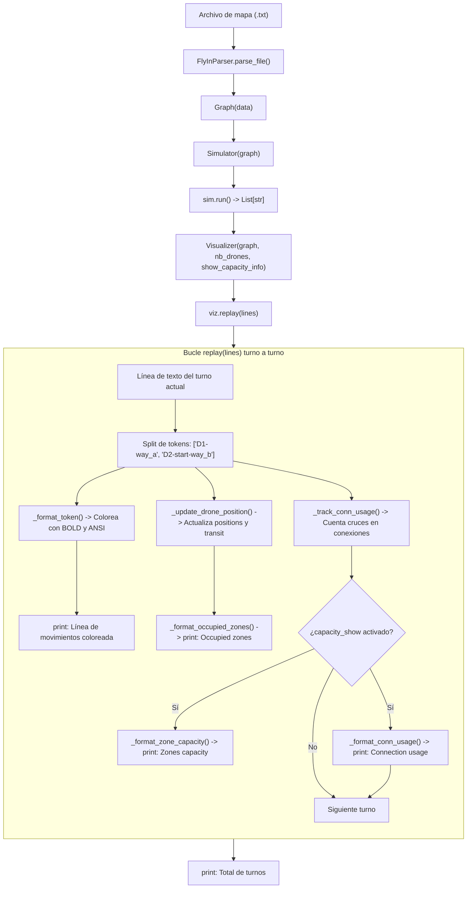
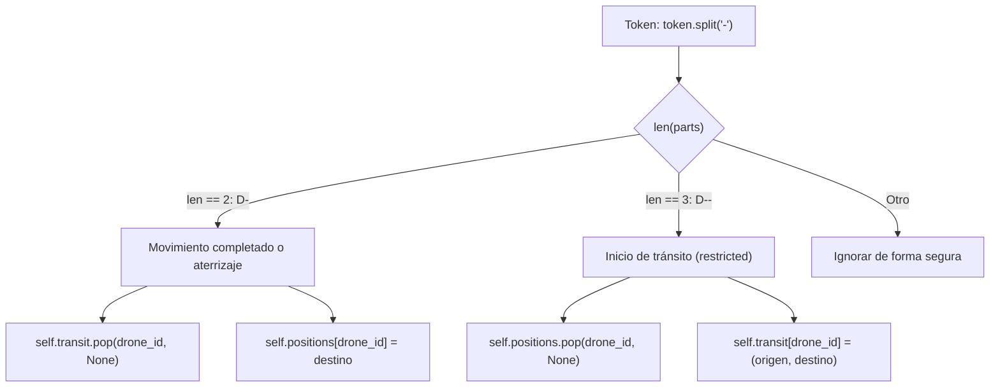

# Visualizer — Explicación detallada

> Este documento explica **línea a línea y concepto a concepto** cómo funciona `visual.py`
> del proyecto Fly-in. A lo largo del documento utilizaremos un **mapa de ejemplo visual**
> para observar cómo se interpretan los tokens de salida, cómo evoluciona el estado interno
> de los drones y cómo se generan los bloques de texto formateados con colores ANSI y métricas de capacidad.

---

## Índice

1. [[#1. Propósito y arquitectura del visualizador|1. Propósito y arquitectura del visualizador]]
   - [[#1.1 Por qué un reproductor pasivo (patrón Replay)|1.1 Por qué un reproductor pasivo (patrón Replay)]]
   - [[#1.2 Diagrama de flujo general|1.2 Diagrama de flujo general]]
2. [[#2. Códigos y estilos de color ANSI|2. Códigos y estilos de color ANSI]]
   - [[#2.1 Secuencias de escape ANSI|2.1 Secuencias de escape ANSI]]
   - [[#2.2 Mapeo de colores y estrategia de fallback|2.2 Mapeo de colores y estrategia de fallback]]
3. [[#3. La clase Visualizer y su estado interno|3. La clase Visualizer y su estado interno]]
   - [[#3.1 Atributos de estado (__init__)|3.1 Atributos de estado (__init__)]]
   - [[#3.2 Separación entre drones estacionarios y en tránsito|3.2 Separación entre drones estacionarios y en tránsito]]
4. [[#4. Métodos auxiliares y procesamiento de tokens|4. Métodos auxiliares y procesamiento de tokens]]
   - [[#4.1 _get_zone_color — resolución del color de zona|4.1 _get_zone_color — resolución del color de zona]]
   - [[#4.2 _format_token — coloreado y tipografía de tokens|4.2 _format_token — coloreado y tipografía de tokens]]
   - [[#4.3 _update_drone_position — máquina de estados por token|4.3 _update_drone_position — máquina de estados por token]]
5. [[#5. Generación de reportes y bloques de texto|5. Generación de reportes y bloques de texto]]
   - [[#5.1 _format_movements_line — procesar la línea del turno|5.1 _format_movements_line — procesar la línea del turno]]
   - [[#5.2 _format_occupied_zones — reporte de zonas y tránsitos|5.2 _format_occupied_zones — reporte de zonas y tránsitos]]
   - [[#5.3 _track_conn_usage — acumulador de uso de enlaces|5.3 _track_conn_usage — acumulador de uso de enlaces]]
   - [[#5.4 _format_zone_capacity — reporte de ocupación vs capacidad|5.4 _format_zone_capacity — reporte de ocupación vs capacidad]]
   - [[#5.5 _format_conn_usage — reporte de uso de enlaces vs capacidad|5.5 _format_conn_usage — reporte de uso de enlaces vs capacidad]]
6. [[#6. Orquestación y reproducción: el método replay|6. Orquestación y reproducción: el método replay]]
   - [[#6.1 Ciclo de vida de un turno en pantalla|6.1 Ciclo de vida de un turno en pantalla]]
   - [[#6.2 Reseteo por turno de estadísticas de enlace|6.2 Reseteo por turno de estadísticas de enlace]]
7. [[#7. Punto de entrada (__main__) y ejecución desde consola|7. Punto de entrada (__main__) y ejecución desde consola]]
   - [[#7.1 Argumentos CLI y flag opcional --show-capacity|7.1 Argumentos CLI y flag opcional --show-capacity]]
   - [[#7.2 Manejo de errores y códigos de salida|7.2 Manejo de errores y códigos de salida]]
8. [[#8. Seguimiento paso a paso con el mapa de ejemplo|8. Seguimiento paso a paso con el mapa de ejemplo]]
   - [[#8.1 El mapa ilustrativo|8.1 El mapa ilustrativo]]
   - [[#8.2 Turno 1: salidas simultáneas y coloración|8.2 Turno 1: salidas simultáneas y coloración]]
   - [[#8.3 Turno 2: aterrizaje forzoso y avance|8.3 Turno 2: aterrizaje forzoso y avance]]
   - [[#8.4 Turno 3: entregas finales y cierre|8.4 Turno 3: entregas finales y cierre]]
9. [[#9. Criterios y decisiones de diseño: ¿por qué se hizo así?|9. Criterios y decisiones de diseño: ¿por qué se hizo así?]]

---

## 1. Propósito y arquitectura del visualizador

### 1.1 Por qué un reproductor pasivo (patrón Replay)

Una tentación habitual al implementar una interfaz de visualización es mezclar el cálculo de rutas y la verificación de colisiones dentro del propio bucle visual. En Fly-in, esa aproximación sería problemática por varias razones:

1. **Principio de responsabilidad única (SRP)**:
   - `simulator.py` es el único responsable de validar capacidades, respetar las dos pasadas del subject (§VII.3) y resolver atascos.
   - `visual.py` actúa como un **reproductor pasivo (*replay*)**: recibe la lista de cadenas de texto generada por `Simulator.run()` y reconstruye visualmente lo sucedido.
2. **Robustez e integridad del simulador**:
   - `simulator.py` puede ejecutarse de forma autónoma (por ejemplo, en scripts automatizados, tests unitarios o tuberías Unix estándar) sin sobrecoste de renderizado de texto.
   - Si `visual.py` tuviese que recalcular colisiones o validar capacidades, se duplicaría la lógica de reservas y existiría el riesgo de discrepancias entre lo simulado y lo mostrado.
3. **Fidelidad al formato del subject (§VII.5)**:
   - Dado que el simulador emite tokens normalizados (`D<id>-<zona>` o `D<id>-<origen>-<destino>`), `visual.py` demuestra que la salida oficial del simulador contiene toda la información necesaria para reconstruir el estado completo del mapa en cualquier instante.

---

### 1.2 Diagrama de flujo general



---

## 2. Códigos y estilos de color ANSI

El terminal interactivo interpreta secuencias de escape especiales para aplicar color, grosor o fondos al texto.

### 2.1 Secuencias de escape ANSI

Las constantes base definidas al inicio del archivo controlan el inicio y fin de los efectos tipográficos:

```python
RESET: str = "\033[0m"
BOLD: str = "\033[1m"
```

- `\033[`: Carácter de escape (`ESC`, código ASCII 27) seguido del corchete que inicia una secuencia de control ANSI (CSI - *Control Sequence Introducer*).
- `1m`: Aplica estilo en **negrita** (*bold*), resaltando el texto.
- `0m`: Restablece todos los atributos a sus valores predeterminados (*reset*). Es imprescindible cerrarlo siempre; de lo contrario, el texto subsiguiente del terminal permanecería coloreado indebidamente.

---

### 2.2 Mapeo de colores y estrategia de fallback

El subject de Fly-in (§VI) señala explícitamente:
> *"The color is a string. There is no fixed list of colors; you can choose whatever you want."*

Al no existir una lista cerrada de colores en la especificación, el visualizador debe ser tolerante a fallos:

```python
_COLOR_CODES: Dict[str, str] = {
    "black": "\033[30m",
    "red": "\033[31m",
    "green": "\033[32m",
    "yellow": "\033[33m",
    "blue": "\033[34m",
    "magenta": "\033[35m",
    "cyan": "\033[36m",
    "white": "\033[37m",
    "gray": "\033[90m",
    "grey": "\033[90m",
    "orange": "\033[38;5;208m",
    "purple": "\033[38;5;93m",
    "brown": "\033[38;5;94m",
    "gold": "\033[38;5;220m",
    "lime": "\033[38;5;154m",
}
_DEFAULT_COLOR: str = "\033[37m"   # blanco: fallback para colores no mapeados
```

#### Decisiones de diseño:
1. **Colores estándar (16 colores ANSI)**: Del código `30m` al `37m` y tonos brillantes como `gray` (`90m`).
2. **Paleta extendida (256 colores ANSI)**: Formato `\033[38;5;<n>m` para colores más específicos que aparecen habitualmente en mapas creativos (`orange`, `purple`, `gold`, `lime`).
3. **Tolerancia y Fallback (`_DEFAULT_COLOR`)**: Si un mapa utiliza un color exótico no registrado (como `turquoise`, `crimson` o `indigo`), `_COLOR_CODES.get(color, _DEFAULT_COLOR)` devuelve blanco en lugar de provocar una excepción `KeyError`.

---

## 3. La clase Visualizer y su estado interno

```python
class Visualizer:
    """Reconstruct and render turn-by-turn simulation states with ANSI colors.

    Attributes:
        graph: Validated Graph instance.
        positions: Mapping from drone label (e.g. 'D1') to stationary zone name.
        transit: Mapping from drone label to (source, destination) while in transit.
        capacity_show: Whether to print zone and connection capacity details.
    """
```

### 3.1 Atributos de estado (__init__)

```python
def __init__(self, graph: Graph, nb_drones: int, show_capacity_info: bool = False):
    self.graph: Graph = graph
    self.positions: Dict[str, str] = {
        f"D{i}": graph.start
        for i in range(1, nb_drones + 1)
    }
    self.transit: Dict[str, Tuple[str, str]] = {}
    self.capacity_show: bool = show_capacity_info
    self._conn_usage: Dict[Tuple[str, str], int] = {}
```

| Atributo | Tipo | Descripción |
|---|---|---|
| `graph` | `Graph` | Instancia del grafo validado. Permite consultar las zonas, su color configurado y la capacidad máxima de las conexiones. |
| `positions` | `Dict[str, str]` | Diccionario que vincula cada dron estacionario con su zona física actual (ej. `{"D1": "way_a", "D2": "start"}`). |
| `transit` | `Dict[str, Tuple[str, str]]` | Diccionario que almacena drones en vuelo hacia una zona `restricted`. Su valor es una tupla `(origen, destino)`. |
| `capacity_show` | `bool` | Booleano activado con `--show-capacity`. Decide si se imprimen los bloques detallados de ocupación y uso de enlaces. |
| `_conn_usage` | `Dict[Tuple[str, str], int]` | Contador de cruces de conexión registrados en el turno en curso. Se vacía al inicio de cada nuevo turno. |

---

### 3.2 Separación entre drones estacionarios y en tránsito

Un detalle conceptual clave del subject (§VII.3) es que un dron que viaja hacia una zona `restricted`:
- Tarda 2 turnos en completar el movimiento.
- Durante el primer turno ya no está en la zona de origen, pero aún no ha llegado a la zona de destino.
- No puede ocupar espacio en ninguna de las dos zonas mientras vuela por la conexión.

Para modelar esto fielmente:
- Si un dron está **parado**, reside en `self.positions` y no en `self.transit`.
- Si un dron está **en tránsito**, reside en `self.transit` y desaparece de `self.positions`.
- Ningún dron puede coexistir a la vez en ambos diccionarios.

---

## 4. Métodos auxiliares y procesamiento de tokens

### 4.1 _get_zone_color — resolución del color de zona

```python
def _get_zone_color(self, zone_name: str) -> str:
    zone = self.graph.zones.get(zone_name)
    color_zone = zone.color if zone else "none"
    color_ansi = _COLOR_CODES.get(color_zone.lower(), _DEFAULT_COLOR)
    return (color_ansi)
```

1. Busca el objeto `Zone` en `graph.zones`.
2. Extrae la propiedad `zone.color`. Si la zona no existe o no tiene color definido, toma `"none"`.
3. Normaliza con `.lower()` para evitar fallos por mayúsculas (ej. `"Red"` vs `"red"`).
4. Devuelve la secuencia ANSI correspondiente o `_DEFAULT_COLOR` si el color no está mapeado.

---

### 4.2 _format_token — coloreado y tipografía de tokens

```python
def _format_token(self, token: str) -> str:
    parts = token.split("-")
    drone_id = parts[0]
    rest_token = token[len(drone_id):]
    zone_name = parts[-1]
    color_ansi = self._get_zone_color(zone_name)

    return (f"{color_ansi}{BOLD}{drone_id}{RESET}{color_ansi}{rest_token}{RESET}")
```

#### ¿Cómo transforma el texto?
Tomemos como ejemplo el token `"D1-way_a"` (donde `way_a` tiene color verde):
1. `parts = ["D1", "way_a"]`.
2. `drone_id = "D1"`.
3. `rest_token = "-way_a"`.
4. `zone_name = parts[-1] = "way_a"`.
5. `color_ansi` es verde (`\033[32m`).
6. El formateo ensambla:
   - `D1` en **verde y negrita**: `{color_ansi}{BOLD}D1{RESET}`.
   - `-way_a` en **verde normal**: `{color_ansi}-way_a{RESET}`.

Si el token es de tránsito, por ejemplo `"D2-start-way_b"`:
- `parts[-1]` es `way_b` (la zona de destino final).
- Todo el token se colorea con el color de `way_b`, manteniendo el prefijo `D2` en negrita.

---

### 4.3 _update_drone_position — máquina de estados por token

```python
def _update_drone_position(self, token: str) -> None:
    parts = token.split("-")
    drone_id = parts[0]

    if len(parts) == 2:
        self.transit.pop(drone_id, None)
        self.positions[drone_id] = parts[1]
    elif len(parts) == 3:
        self.positions.pop(drone_id, None)
        self.transit[drone_id] = (parts[1], parts[2])
```

El token generado por el simulador cumple de forma determinista la especificación del subject (§VII.5):



- **Caso 2 partes (`len == 2`)**: Representa la llegada de un dron a una zona (`"D1-way_a"` o fin de tránsito `"D2-way_b"`). Si estaba registrado en `self.transit`, se elimina mediante `.pop(drone_id, None)` y se anota su nueva ubicación fija en `self.positions`.
- **Caso 3 partes (`len == 3`)**: Representa un dron que ha entrado en vuelo hacia una zona restricted (`"D2-start-way_b"`). Se retira de `self.positions` (ya no está físicamente posado en la zona de origen) y se registra en `self.transit` como `("start", "way_b")`.

---

## 5. Generación de reportes y bloques de texto

### 5.1 _format_movements_line — procesar la línea del turno

```python
def _format_movements_line(self, line: str) -> str:
    colored_tokens: List[str] = []
    tokens: List[str] = line.split()
    for token in tokens:
        self._track_conn_usage(token)
        self._update_drone_position(token)
        colored_tokens.append(self._format_token(token))

    return (" ".join(colored_tokens))
```

Por cada token separado por espacios en la línea del turno:
1. Registra el cruce del enlace en `_track_conn_usage()`.
2. Actualiza la posición del dron en `_update_drone_position()`.
3. Aplica formato y color ANSI con `_format_token()`.
4. Recombina todos los tokens formateados unidos por espacios.

---

### 5.2 _format_occupied_zones — reporte de zonas y tránsitos

```python
def _format_occupied_zones(self) -> List[str]:
    zone_drones: Dict[str, List[str]] = {}
    for drone, zone in self.positions.items():
        zone_drones.setdefault(zone, []).append(drone)
    lines: List[str] = []
    for zone_name, drones_in_zone in sorted(zone_drones.items()):
        color = self._get_zone_color(zone_name)
        ordenados = sorted(drones_in_zone)
        drones_bold = [f"{BOLD}{d}{RESET}" for d in ordenados]
        label: str = " ".join(drones_bold)

        lines.append(f"{color}{zone_name}{RESET}: {label}")

    if self.transit:
        for drone_id in sorted(self.transit):
            src, dst = self.transit[drone_id]
            lines.append(f"in transit: {drone_id}: {src} -> {dst}")

    return lines
```

- **Agrupación inversa**: `self.positions` asocia `dron -> zona`. Este método invierte la relación a `zona -> [drones]`, mostrando de forma clara qué drones están agrupados en cada ubicación.
- **Orden determinista**: Se ordena alfabéticamente tanto el nombre de las zonas (`sorted(zone_drones.items())`) como la lista interna de drones (`sorted(drones_in_zone)`), garantizando una salida reproducible en pantalla.
- **Drones en vuelo**: Si hay entradas activas en `self.transit`, las desglosa indicando `in transit: D<id>: origen -> destino`.

---

### 5.3 _track_conn_usage — acumulador de uso de enlaces

```python
def _track_conn_usage(self, token: str) -> None:
    parts = token.split("-")
    drone = parts[0]

    if len(parts) == 2:
        if drone in self.transit:
            src = self.transit[drone][0]
        else:
            src = self.positions.get(drone)
        dst = parts[1]
    elif len(parts) == 3:
        if drone in self.transit:
            return
        src, dst = parts[1], parts[2]

    clave = tuple(sorted((src, dst)))
    self._conn_usage[clave] = self._conn_usage.get(clave, 0) + 1
```

#### Deducción del origen y destino de un cruce:
1. **Si `len(parts) == 2` (salto directo o aterrizaje)**:
   - Si el dron ya estaba en tránsito (`drone in self.transit`), su origen real de enlace fue el nodo de partida de dicho tránsito (`self.transit[drone][0]`).
   - Si no estaba en tránsito, su origen era la zona donde estaba posado (`self.positions.get(drone)`).
   - Su destino es `parts[1]`.
2. **Si `len(parts) == 3` (despegue hacia restricted)**:
   - Su origen es `parts[1]` y su destino es `parts[2]`.
   - Si el dron ya figuraba en tránsito por un turno previo, retorna para no duplicar el cómputo.
3. **Clave canónica bidireccional**: Al igual que en el simulador, se usa `tuple(sorted((src, dst)))`. De este modo, cruzar de A a B o de B a A incrementa el contador del mismo enlace físico no dirigido.

---

### 5.4 _format_zone_capacity — reporte de ocupación vs capacidad

```python
def _format_zone_capacity(self) -> List[str]:
    lines: List[str] = []
    zone_drones: Dict[str, List[str]] = {}

    for drone, zone in self.positions.items():
        zone_drones.setdefault(zone, []).append(drone)

    for zone_name, drones_in_zone in sorted(zone_drones.items()):
        cap: int = len(drones_in_zone)
        zone = self.graph.zones.get(zone_name)
        max_cap = zone.max_drones if zone else 0
        if zone_name in (self.graph.end, self.graph.start):
            max_cap = "inf"
        lines.append(f"{zone_name} capacity: ({cap}/{max_cap})")
    return lines
```

- Calcula cuántos drones hay posados en cada zona (`cap = len(drones_in_zone)`).
- Compara con el valor nominal `zone.max_drones`.
- Si la zona es `start` o `end`, muestra `"inf"` de acuerdo con la especificación del subject (§VII.2 y §VII.4).
- Ejemplo de salida: `loop_a capacity: (2/2)`, `start capacity: (4/inf)`.

---

### 5.5 _format_conn_usage — reporte de uso de enlaces vs capacidad

```python
def _format_conn_usage(self) -> List[str]:
    lines: List[str] = []
    for (src, dst) in sorted(self._conn_usage):
        used = self._conn_usage[(src, dst)]
        for conn in self.graph.connections_from(src):
            if conn.target == dst:
                max_cap = conn.max_link_capacity
                break
        else:
            max_cap = 0

        lines.append(f"{src}-{dst}:     ({used}/{max_cap} used)")
    return lines
```

- Itera sobre las conexiones que han tenido actividad durante el turno actual.
- Consulta en el grafo la capacidad máxima real de ese enlace (`conn.max_link_capacity`).
- Formatea la línea de uso: `exit_point-loop_b:     (1/1 used)`.

---

## 6. Orquestación y reproducción: el método replay

```python
def replay(self, lines: List[str]) -> None:
    """Replay full simulation turn by turn with formatted ANSI output.

    Args:
        lines: List of turn strings produced by Simulator.run().
    """
    for i, line in enumerate(lines, 1):
        self._conn_usage = {}
        print(f"{BOLD}-- Turno {i} --{RESET}")
        print(self._format_movements_line(line))

        print("\nOccupied zones:")
        for d in (self._format_occupied_zones()):
            print(f" - {d}")

        if self.capacity_show:
            print("\nZones capacity:")
            for z in self._format_zone_capacity():
                print(f" - {z}")

            print("\nConnection usage:")
            for conn in self._format_conn_usage():
                print(f" - {conn}")

        print()

    print(f"\n{BOLD}Total: {len(lines)} turnos{RESET}")
```

### 6.1 Ciclo de vida de un turno en pantalla

Para cada línea recibida:
1. **Reseteo de contadores efímeros**: `self._conn_usage = {}` vacía el recuento de aristas del turno anterior.
2. **Encabezado del turno**: Imprime `-- Turno i --` en negrita con guiones ASCII compatibles.
3. **Movimientos activos**: Llama a `_format_movements_line(line)`, que actualiza el estado e imprime los tokens coloreados.
4. **Zonas ocupadas**: Lista cada zona con drones posados y cualquier dron que se encuentre en el aire.
5. **Bloques opcionales de diagnóstico**: Si `self.capacity_show` está activo, desglosa la ocupación respecto a `max_drones` y el volumen de tráfico respecto a `max_link_capacity`.
6. **Conclusión**: Tras iterar todas las líneas, imprime el total de turnos invertidos.

---

## 7. Punto de entrada (__main__) y ejecución desde consola

```python
if __name__ == "__main__":
    import os
    import sys

    from map_parser import FlyInParser
    from simulator import Simulator

    target = sys.argv[1] if len(sys.argv) > 1 else "map_path.txt"
    capacity = "--show-capacity" in sys.argv

    if not os.path.exists(target):
        print(f"ERROR: '{target}' no encontrado.", file=sys.stderr)
        sys.exit(1)

    try:
        data = FlyInParser().parse_file(target)
        graph = Graph(data)
        sim = Simulator(graph)
        lines = sim.run()
    except ValueError as e:
        print(f"ERROR: {e}", file=sys.stderr)
        sys.exit(2)

    if capacity:
        print("\n----Activado mostrar ocupaciones.----\n")

    print(f"Mapa : {target}")
    print(f"Start: {graph.start}  ->  End: {graph.end}")
    print(f"Drones: {graph.nb_drones}\n")

    viz = Visualizer(graph, graph.nb_drones, show_capacity_info=capacity)
    viz.replay(lines)
```

### 7.1 Argumentos CLI y flag opcional --show-capacity

- **Ruta del mapa**: Puede indicarse como primer argumento en la consola:
  ```bash
  python visual.py maps/05_circular_loop.txt
  ```
  Si no se proporciona ningún argumento, toma por defecto `"map_path.txt"`.
- **Flag `--show-capacity`**: Puede añadirse en cualquier posición de la llamada:
  ```bash
  python visual.py map_path.txt --show-capacity
  ```
  Detecta su presencia mediante `"--show-capacity" in sys.argv`.

### 7.2 Manejo de errores y códigos de salida

- Si el archivo indicado no existe: Imprime el error por `sys.stderr` y termina con código de salida `1`.
- Si el parser o el simulador lanzan un `ValueError` (archivo sintácticamente erróneo, mapa inconexo o sin ruta válida entre `start` y `end`): Imprime el mensaje descriptivo por `sys.stderr` y finaliza con código de salida `2`.

---

## 8. Seguimiento paso a paso con el mapa de ejemplo

Para ver el comportamiento exacto de `visual.py`, utilizaremos el mapa de prueba con rutas paralelas y una zona `restricted`:

### 8.1 El mapa ilustrativo

```
nb_drones: 3

start_hub: start 0 0
hub: way_a 1 1 [color=green max_drones=1]
hub: way_b 1 -1 [zone=restricted color=yellow max_drones=1]
end_hub: goal 2 0 [color=blue]

connection: start-way_a
connection: way_a-goal
connection: start-way_b
connection: way_b-goal
```

El simulador genera 3 líneas de texto para este mapa:
```
Línea 1: D1-way_a D2-start-way_b
Línea 2: D1-goal D2-way_b D3-way_a
Línea 3: D2-goal D3-goal
```

---

### 8.2 Turno 1: salidas simultáneas y coloración

- **Línea recibida**: `"D1-way_a D2-start-way_b"`
- **Procesamiento de tokens**:
  - `D1-way_a`: `len == 2`.
    - `positions["D1"] = "way_a"`.
    - Color de `way_a` = verde (`\033[32m`).
  - `D2-start-way_b`: `len == 3`.
    - Se elimina `D2` de `positions`.
    - `transit["D2"] = ("start", "way_b")`.
    - Color de `way_b` = amarillo (`\033[33m`).
  - `D3`: No aparece en la línea (se queda esperando en `start`).

**Salida en consola:**
```text
-- Turno 1 --
D1-way_a D2-start-way_b

Occupied zones:
 - start: D3
 - way_a: D1
 - in transit: D2: start -> way_b

Zones capacity:
 - start capacity: (1/inf)
 - way_a capacity: (1/1)

Connection usage:
 - start-way_a:     (1/1 used)
 - start-way_b:     (1/1 used)
```

---

### 8.3 Turno 2: aterrizaje forzoso y avance

- **Línea recibida**: `"D1-goal D2-way_b D3-way_a"`
- **Procesamiento de tokens**:
  - `D1-goal`: `len == 2`.
    - `positions["D1"] = "goal"`. Color de `goal` = azul (`\033[34m`).
  - `D2-way_b`: `len == 2`.
    - Aterrizaje del dron en tránsito: `transit.pop("D2")`.
    - `positions["D2"] = "way_b"`. Color de `way_b` = amarillo.
  - `D3-way_a`: `len == 2`.
    - `positions["D3"] = "way_a"`. Color de `way_a` = verde.

**Salida en consola:**
```text
-- Turno 2 --
D1-goal D2-way_b D3-way_a

Occupied zones:
 - goal: D1
 - way_a: D3
 - way_b: D2

Zones capacity:
 - goal capacity: (1/inf)
 - way_a capacity: (1/1)
 - way_b capacity: (1/1)

Connection usage:
 - goal-way_a:     (1/1 used)
 - start-way_a:     (1/1 used)
 - start-way_b:     (1/1 used)
```

---

### 8.4 Turno 3: entregas finales y cierre

- **Línea recibida**: `"D2-goal D3-goal"`
- **Procesamiento de tokens**:
  - `D2-goal`: `len == 2`. `positions["D2"] = "goal"`.
  - `D3-goal`: `len == 2`. `positions["D3"] = "goal"`.

**Salida en consola:**
```text
-- Turno 3 --
D2-goal D3-goal

Occupied zones:
 - goal: D1 D2 D3

Zones capacity:
 - goal capacity: (3/inf)

Connection usage:
 - goal-way_a:     (1/1 used)
 - goal-way_b:     (1/1 used)


Total: 3 turnos
```

Todos los drones han llegado a `goal` y la simulación concluye con éxito.

---

## 9. Criterios y decisiones de diseño: ¿por qué se hizo así?

| Decisión de diseño | ¿Por qué no la alternativa obvia? | Beneficio en Fly-in |
|---|---|---|
| **Arquitectura de Replay pasivo** | Si se ejecutara la simulación a la vez que el dibujado, se acoplarían responsabilidades y se duplicaría la lógica de capacidad. | Mantiene `simulator.py` 100% puro y permite verificar que las cadenas de texto del subject contienen información completa. |
| **Máquina de estados por longitud (`split("-")`)** | Usar expresiones regulares complejas o parsers pesados ralentizaría la reproducción innecesariamente. | Separar por guiones distingue de forma inmediata saltos estándar (`len == 2`) de vuelos restringidos (`len == 3`). |
| **Separar `positions` y `transit`** | Guardar drones en vuelo dentro de `positions` provocaría que apareciesen erróneamente en el conteo de ocupación de zonas. | Modela de manera rigurosa la regla de que un dron en tránsito no está físicamente posado en ninguna zona. |
| **Clave canónica alfabética en enlaces** | Usar `(origen, destino)` como clave registraría `A-B` y `B-A` como enlaces independientes. | Unifica el tráfico bidireccional sobre la misma arista física, reflejando el límite real de `max_link_capacity`. |
| **Fallback en colores ANSI** | Lanzar una excepción `KeyError` ante un color no reconocido quebraría la ejecución con mapas válidos pero originales. | Cumple el requisito del subject (§VI: *"no fixed list"*), garantizando que cualquier nombre de color funcione sin caídas. |
| **Uso de guiones ASCII en encabezados (`-- Turno i --`)** | Los caracteres Unicode de caja (`──`) provocan `UnicodeEncodeError` en terminales de Windows con codificación CP1252. | Portabilidad multiplataforma garantizada entre Linux, macOS y Windows sin depender de la configuración regional. |
